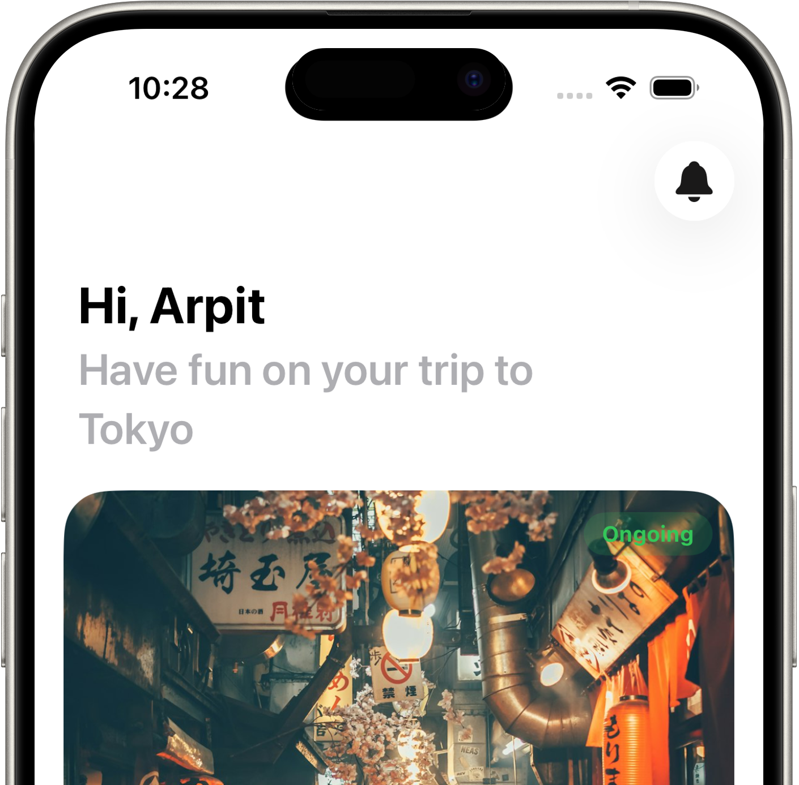
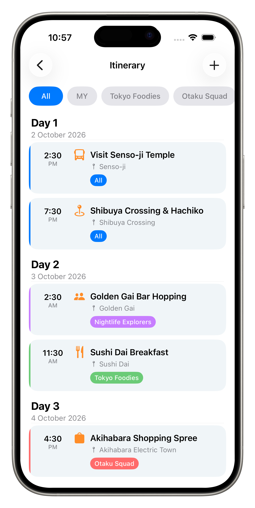
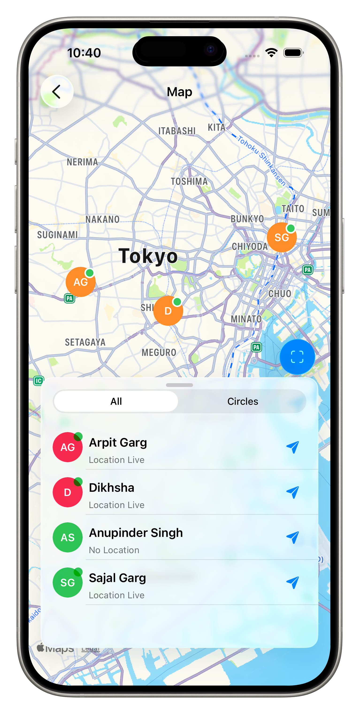
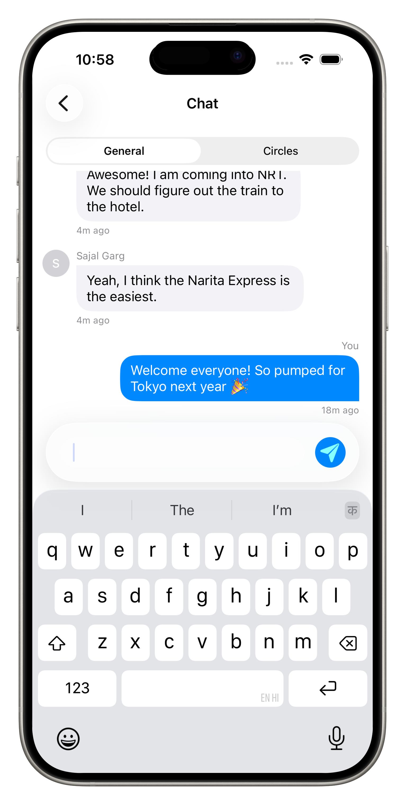

<p align="center">
  
</p>

<h1 align="center">✈️ TripSync – Travel Companion</h1>

<p align="center">
  <strong>Stay Connected, Wherever You Wander</strong>
</p>

<p align="center">
  
  
  
  
</p>

<br/>

<p align="center">
  
</p>

<br/>

> **TripSync** is a native iOS app that makes group travel effortless. Plan trips, coordinate with your travel crew in real time, build day-by-day itineraries, and always know where your friends are — all from one elegant interface.

---

## ✨ Features

<table>
  <tr>
    <td width="50%" valign="top">
      <h3>🗺️ Trip Management</h3>
      <ul>
        <li><strong>Create trips</strong> with destination, dates, and beautiful cover images powered by Unsplash</li>
        <li><strong>Join trips</strong> via shareable invite codes or QR codes</li>
        <li>Trips are automatically categorised as <strong>Current</strong>, <strong>Upcoming</strong>, or <strong>Past</strong></li>
      </ul>
    </td>
    <td width="50%" valign="top">
      <h3>👥 Circles & Subgroups</h3>
      <ul>
        <li>Organise trip members into interest-based <strong>circles</strong> (e.g. "Food Explorers", "Adventure Seekers")</li>
        <li>Each circle gets its own chat and itinerary filter</li>
        <li>Invite specific members to circles within a trip</li>
      </ul>
    </td>
  </tr>
  <tr>
    <td width="50%" valign="top">
      <h3>📋 Itinerary Planning</h3>
      <ul>
        <li>Build a collaborative, day-by-day itinerary with stops and activities</li>
        <li>Filter itinerary by circle to see what matters to your subgroup</li>
        <li>Dates are validated against the trip window</li>
        <li><strong>Real-time sync</strong> — everyone sees changes instantly</li>
      </ul>
    </td>
    <td width="50%" valign="top">
      <h3>💬 Real-Time Chat</h3>
      <ul>
        <li><strong>General chat</strong> for all trip members</li>
        <li><strong>Circle-specific chats</strong> for focused discussion</li>
        <li><strong>Announcements</strong> for important trip-wide updates</li>
        <li>Messages sync live via Supabase Realtime</li>
      </ul>
    </td>
  </tr>
  <tr>
    <td width="50%" valign="top">
      <h3>📍 Live Location Sharing</h3>
      <ul>
        <li>Opt-in GPS sharing with full privacy controls</li>
        <li>Three modes: <strong>Off</strong> (default), <strong>Trip Only</strong>, or <strong>All Trips</strong></li>
        <li>Set time-limited sharing that auto-expires</li>
        <li>Interactive map view with all members' positions</li>
      </ul>
    </td>
    <td width="50%" valign="top">
      <h3>🔔 Notifications & Alerts</h3>
      <ul>
        <li>Real-time push notifications for invitations, updates, and announcements</li>
        <li>In-app notification centre with trip alerts</li>
      </ul>
    </td>
  </tr>
  <tr>
    <td width="50%" valign="top">
      <h3>🔐 Security & Privacy</h3>
      <ul>
        <li>Email + password auth with email verification</li>
        <li>Password reset via deep link</li>
        <li><strong>Face ID / Touch ID</strong> app lock</li>
        <li>No third-party trackers or ad SDKs — your data stays yours</li>
      </ul>
    </td>
    <td width="50%" valign="top">
      <h3>🎓 Onboarding</h3>
      <ul>
        <li>Coach marks walk new users through every section of the app</li>
      </ul>
    </td>
  </tr>
</table>

---

## 📸 Screenshots

<p align="center">
  
  &nbsp;&nbsp;&nbsp;
  
  &nbsp;&nbsp;&nbsp;
  
</p>

---

## 🏗️ Tech Stack

| Layer | Technology |
|:---|:---|
| **Language** | Swift 5.9 |
| **UI Framework** | UIKit (Storyboards + programmatic) |
| **Backend** | [Supabase](https://supabase.com) (Postgres, Auth, Realtime, Storage) |
| **Real-Time** | Supabase Realtime (Postgres Changes) |
| **Image Search** | Unsplash API |
| **Auth** | Supabase Auth (email/password) |
| **Biometrics** | Local Authentication (Face ID / Touch ID) |
| **Deep Linking** | Custom URL scheme (`tripsync://`) |
| **Local Persistence** | Core Data + CloudKit |
| **Location** | Core Location (background mode) |

---

## 📂 Project Structure

```
TripSync/
├── TripSync.xcodeproj          # Xcode project
├── privacy_policy.md           # Published privacy policy
├── terms_of_service.md         # Published terms of service
├── supabase/                   # Supabase configuration
└── TripSync/
    ├── AppDelegate.swift       # App lifecycle + Core Data stack
    ├── SceneDelegate.swift     # Scene lifecycle + deep link routing
    ├── Info.plist               # App configuration
    ├── Assets.xcassets/         # Images & colours
    ├── Storyboards/             # Interface Builder storyboards
    ├── Models/
    │   └── Structs/             # Data models (Trip, Circle, Message, etc.)
    ├── Services/                # Business logic & networking
    │   ├── SupabaseManager      # Supabase client singleton
    │   ├── AuthService          # Sign up, sign in, sign out
    │   ├── TripService          # CRUD for trips & memberships
    │   ├── ItineraryService     # Itinerary item management
    │   ├── CircleService        # Circle/subgroup management
    │   ├── MessageService       # Chat message operations
    │   ├── ChatSession          # Active chat session state
    │   ├── RealtimeManager      # Supabase Realtime subscriptions
    │   ├── LocationService      # GPS tracking & sharing
    │   ├── InvitationService    # Invite code generation & joining
    │   ├── NotificationService  # Push notification management
    │   ├── ProfileService       # User profile & avatar management
    │   ├── UnsplashService      # Cover image search
    │   ├── DeepLinkRouter       # URL scheme handling
    │   └── AppLockService       # Face ID / biometric lock
    ├── Controllers/             # View controllers organised by contributor
    ├── Elements/                # Reusable UI components
    └── Extensions/              # Swift extensions & helpers
```

---

## 🚀 Getting Started

### Prerequisites

| Requirement | Version |
|:---|:---|
| Xcode | 15+ (Swift 5.9) |
| iOS Target | 16+ |
| Backend | [Supabase](https://supabase.com) (pre-configured) |

### Build & Run

```bash
# 1. Clone the repository
git clone https://github.com/HumanKit-TripSync/TripSync.git
cd TripSync

# 2. Open in Xcode
open TripSync.xcodeproj

# 3. Select a target device (iPhone simulator or physical device)

# 4. Build & Run — press ⌘R
```

> [!NOTE]
> The Supabase URL and publishable key are pre-configured in `SupabaseManager.swift`. To use your own backend, update the values there.

---

## 🔧 Configuration

### Supabase Backend

The app connects to Supabase for all backend services. Key configuration lives in:

- **`Services/SupabaseManager.swift`** — Supabase URL, API key, and client setup
- **Deep link scheme** — `tripsync://` (configured in `Info.plist`)

### Database Schema

| Table | Purpose |
|:---|:---|
| `trips` | Trip metadata (name, destination, dates, invite code) |
| `trip_members` | User ↔ Trip membership with roles |
| `circles` | Subgroups within trips |
| `itinerary_items` | Day-by-day stops and activities |
| `messages` | Chat messages (general, circle, announcements) |
| `member_locations` | Real-time GPS coordinates |
| `notifications` | In-app notifications |
| `profiles` | User profile data and preferences |
| `invitations` | Trip invitation records |

---

## 📜 Legal

| Document | Link |
|:---|:---|
| Privacy Policy | [View](privacy_policy.md) |
| Terms of Service | [View](terms_of_service.md) |

---

## 📬 Contact

Have questions, feedback, or just want to say hi?

📧 **Email:** [tripsync.humankit@gmail.com](mailto:tripsync.humankit@gmail.com)

---

<p align="center">
  
  <br/>
  <strong>TripSync – Travel Companion</strong><br/>
  <em>Stay Connected, Wherever You Wander ✈️</em><br/><br/>
  Made with ❤️ for travellers everywhere
</p>
